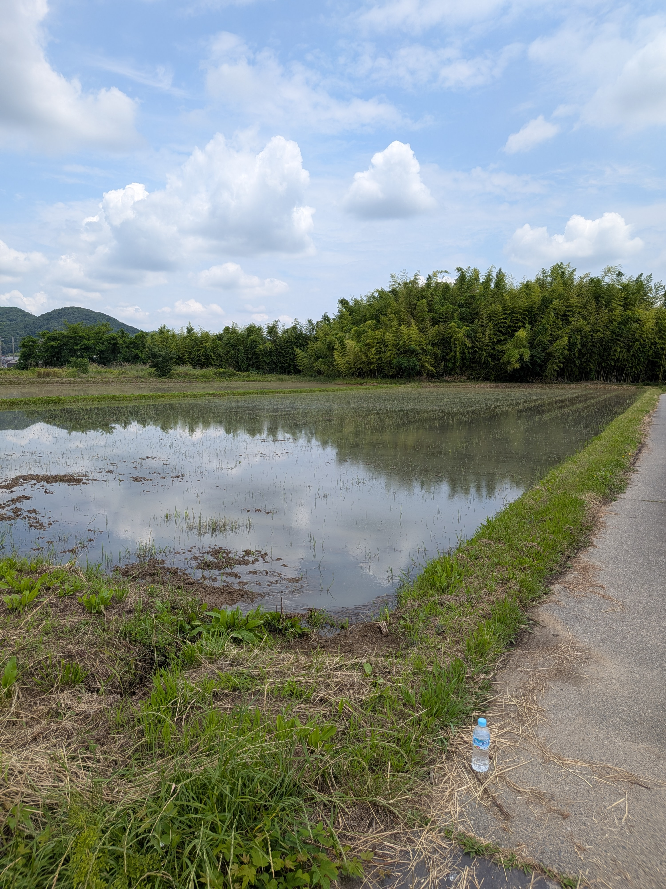
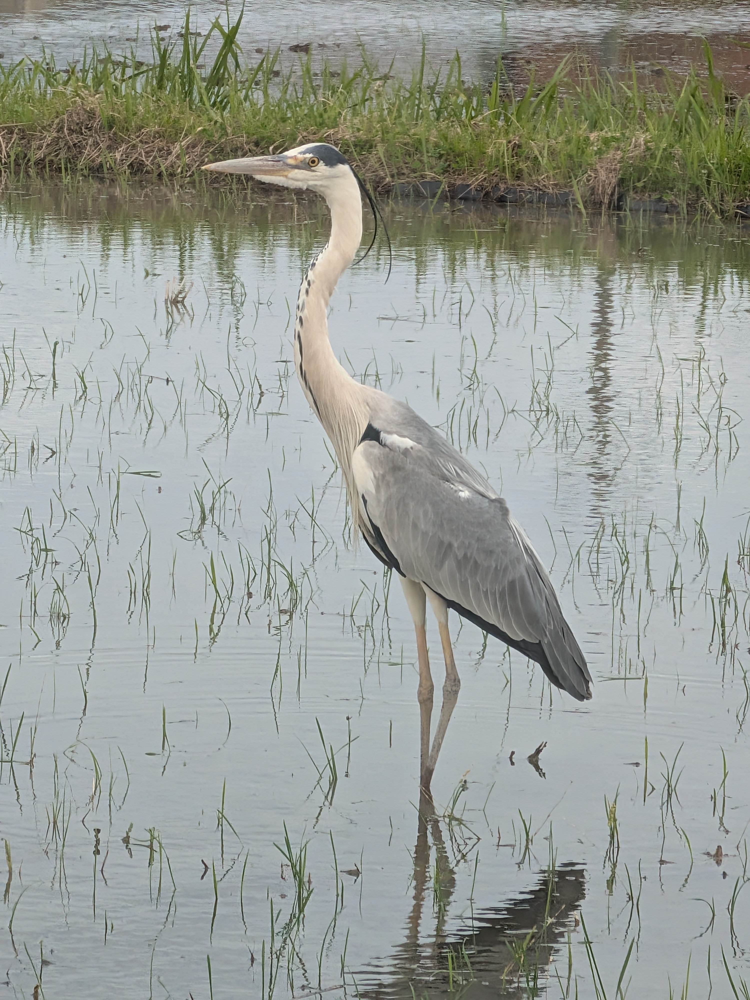
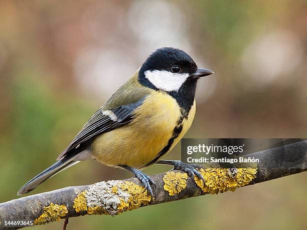

<!-- _class: lead -->
<!-- _paginate: false -->

# 田植えでアオサギに出会った話

---

## 今年の田植えにて

- 田んぼで作業していたら **アオサギ** が目の前に
- じっと立って、悠然と構えている姿が **めちゃくちゃかっこいい**
- 思わず写真を撮った

---

## アオサギってどんな鳥？

- 日本最大級のサギ（全長約 90cm）
- 田んぼや川辺でよく見かける
- 灰色の翼と長い首が特徴

---

## そういえば…

鳥たちを見て思い出した研究がある

- 鳥の鳴き声には **意味がある** という研究
- 東京大学の研究者が **動物の言語** を解き明かしている
- せっかくなので紹介したい

---

## 鈴木俊貴 准教授（東京大学 先端研）

- **世界初** の「動物言語学」専門研究室を設立
- 動物の鳴き声やジェスチャーの **意味** を解析
- 「動物たちの会話がわかる未来」を目指している

---

## シジュウカラの言語能力

鈴木准教授の代表的な発見:

- シジュウカラは **鳴き声を使い分けて** 異なる意味を伝える
- さらに鳴き声を **組み合わせて** 複雑なメッセージを作れる
- → 人間の言語に近い **文法のような構造** を持っている

---

## つまり…

- 鳥は「ただ鳴いている」のではない
- **意味のあるコミュニケーション** をしている
- あの田んぼのアオサギも、何かを「語って」いたのかもしれない

---

## 参考

- [鈴木俊貴 - 東京大学 先端科学技術研究センター](https://www.rcast.u-tokyo.ac.jp/ja/research/people/staff-suzuki_toshitaka.html)
