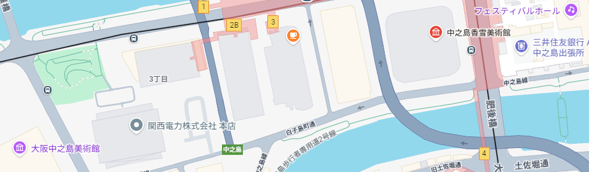
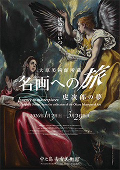
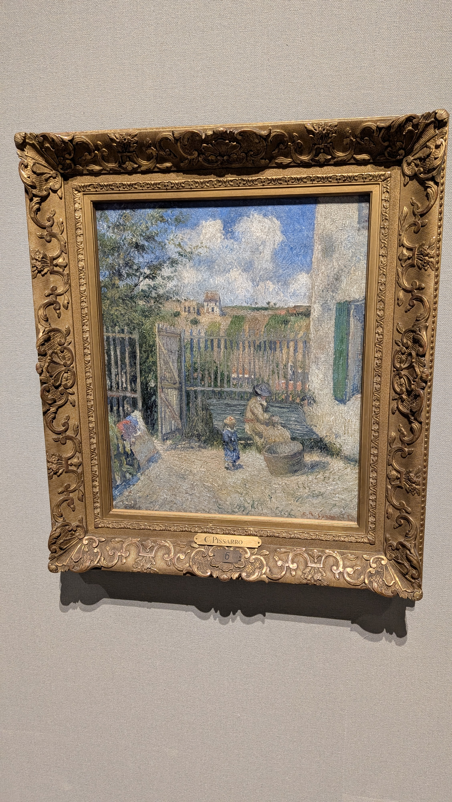
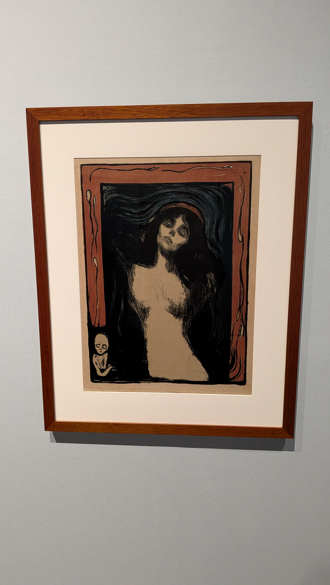
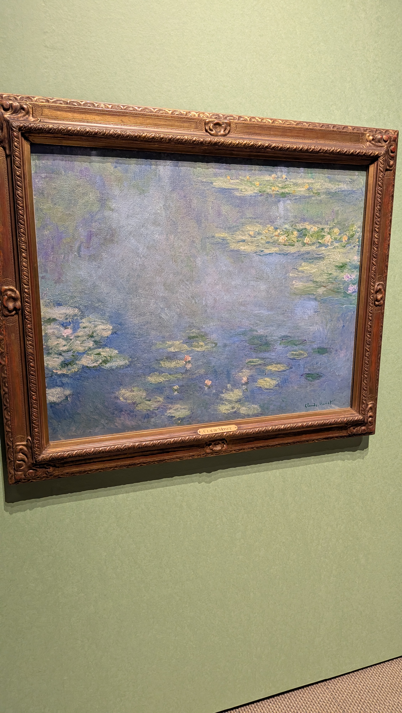
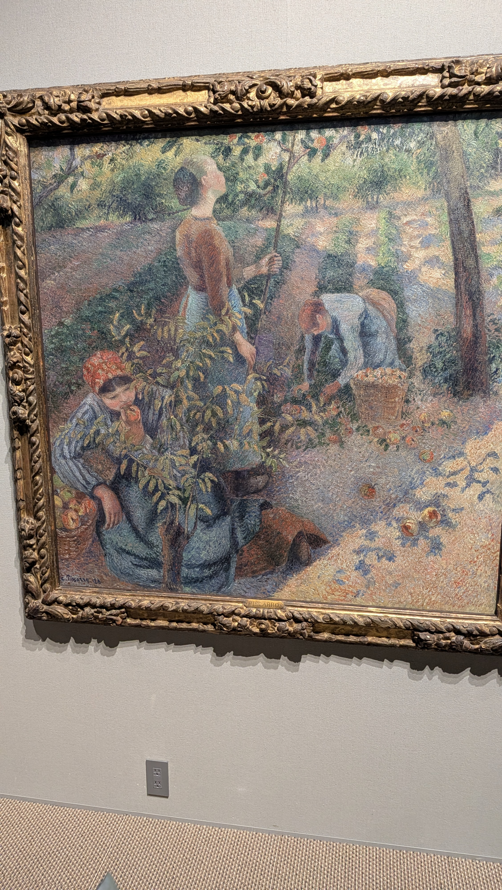
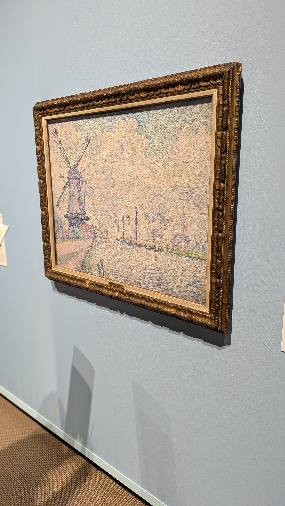

<!-- _class: lead -->
<!-- _paginate: false -->

# 香雪美術館に行ってきた

---

## 中之島香雪美術館
- 朝日新聞社の創業者である村山龍平(1850～1933年)が収集した日本と東アジアの古い時代の美術品を所蔵している美術館

---

## 大原美術館所蔵 名画への旅ー虎次郎の夢

- 虎次郎がヨーロッパを渡り歩いて集めた名画たちがある
  - [虎次郎について](https://nariwa-museum.jp/torajiro_kojima/)
- ゴーギャンやモネ、ピカソなどの作品が展示されている
- 3月29日まで

---

---

---
## オーヴェルシーの運河 ポール・シニャック
- 点描（テンビョウ）という点やとても短いタッチで表現する技法

